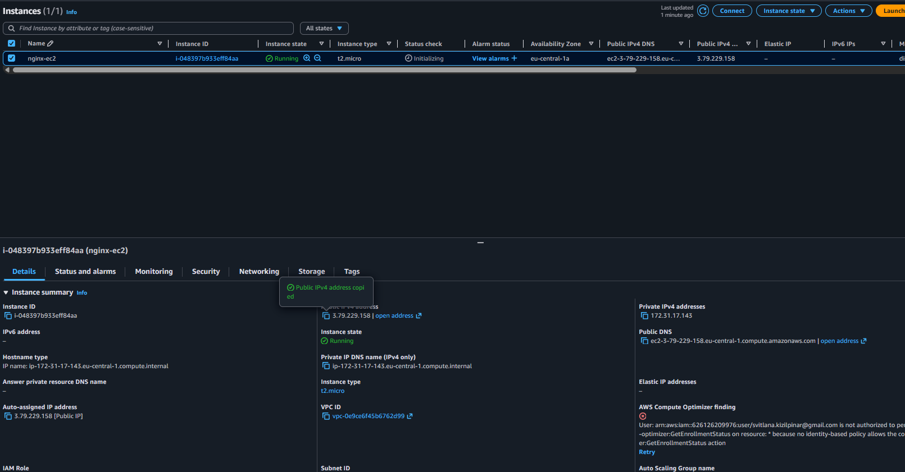
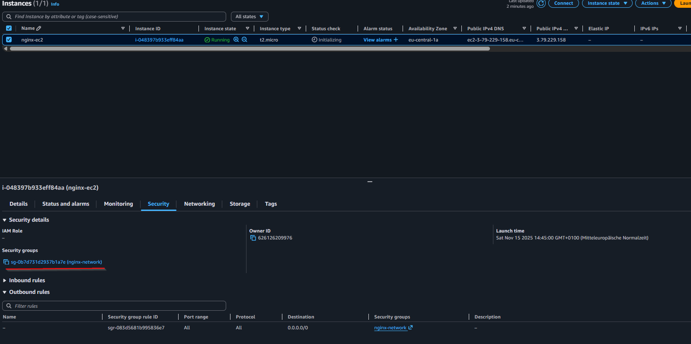
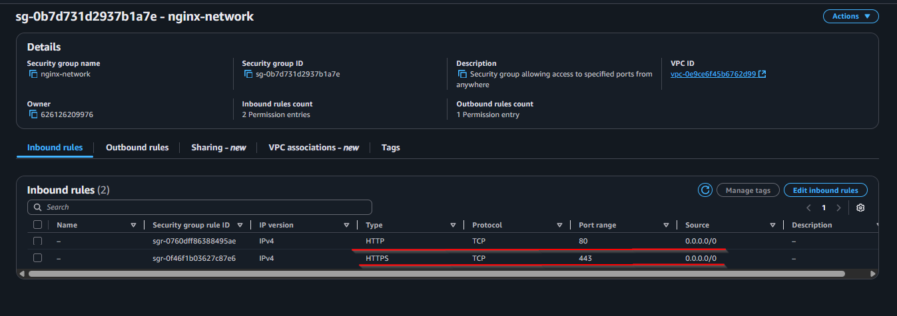
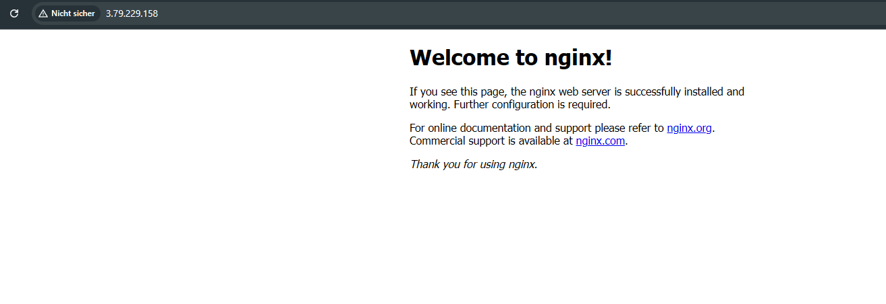
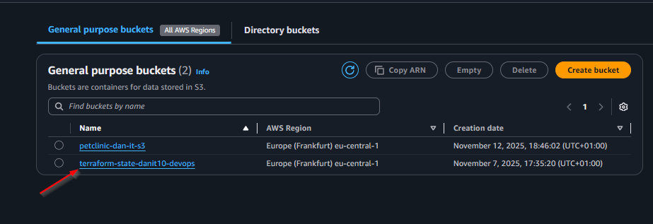
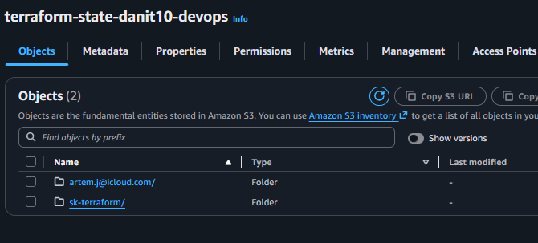
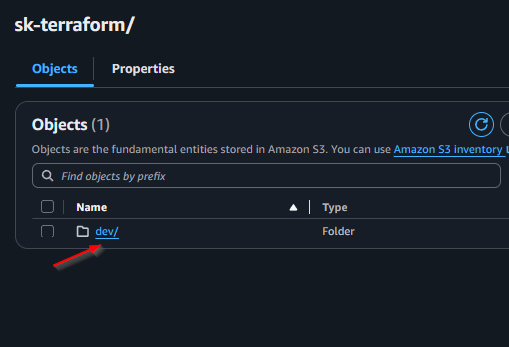
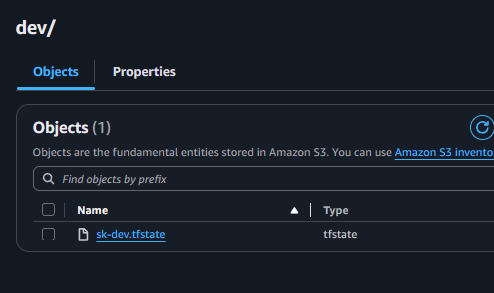

# AWS Terraform Infrastructure Project

## Опис
Цей проект автоматично створює AWS інфраструктуру за допомогою Terraform:
- Security Group з відкритими портами (80, 443)
- EC2 інстанс з Ubuntu та Nginx
- S3 backend для збереження стейту
- Модульна структура: окремі модулі для network та ec2
- Автоматичний вибір VPC, Subnet, AMI через data sources

## Структура проекту
```
terraform/
├── environments/
│   └── dev/
│       ├── main.tf
│       ├── data.tf
│       ├── variables.tf
│       ├── locals.tf
│       └── dev.tfvars
├── modules/
│   ├── network/
│   │   ├── variables.tf
│   │   ├── security_group.tf
│   │   └── outputs.tf
│   └── ec2/
│       ├── variables.tf
│       ├── ec2.tf
│       ├── outputs.tf
│       └── templates/
│           └── user-data.sh
└── terraform-init.sh
```

## 📋 Передумови

Перед початком переконайтеся, що у вас є:

- ✅ AWS аккаунт (безкоштовний tier підійде)
- ⏳ AWS CLI (встановимо в кроці 1)
- ⏳ Terraform (встановимо в кроці 2)
- ✅ Базове розуміння командного рядка
- ✅ Текстовий редактор (VS Code рекомендується)

## 🔐 Крок 1: Налаштування AWS доступу

**Мета**: Встановити AWS CLI і налаштувати безпечний доступ до AWS для Terraform

### 1.1 Встановлення AWS CLI

**Статус**: ✅ Завершено (aws-cli/2.31.32)

AWS CLI потрібен для взаємодії з AWS з командного рядка. Terraform використовує ті ж самі credentials.

**📋 Детальні інструкції**: [install-aws-cli.md](docs/install-aws-cli.md)  

**Швидке встановлення для Windows:**
1. Завантажте MSI installer: https://awscli.amazonaws.com/AWSCLIV2.msi
2. Запустіть installer → Перезапустіть термінал
3. Перевірте: `aws --version` (має показати aws-cli/2.31.32)

### 1.2 Проблема з правами доступу до S3

**❌ Проблема**: Початковий користувач AWS не мав прав для створення S3 bucket та роботи з Terraform backend.

**🔍 Причина**: У основного AWS користувача були обмежувальні політики (explicit deny), які блокували доступ до S3 сервісу.

**✅ Рішення**: Створити окремого користувача спеціально для Terraform з мінімальними необхідними правами.


## 🛠️ Крок 2: Встановлення Terraform

**Статус**: ✅ Завершено (Terraform v1.13.5)

**Мета**: Встановити Terraform для керування інфраструктурою як код (IaC)

**📋 Детальні інструкції**: [install-terraform.md](docs/install-terraform.md)

**Швидке встановлення:**
1. Завантажити з https://www.terraform.io/downloads.html
2. Розпакувати і додати до PATH
3. Або через winget: `winget install Hashicorp.Terraform`
4. Перевірити: `terraform --version` (має показати v1.13.5)

## Запуск

## Налаштування AWS користувача
1. Створіть IAM користувача з ім'ям `sk-terraform-user`. **📋 Детальні інструкції**: [create-terraform-user.md](docs/create-terraform-user.md)
2. Згенеруйте для нього Access Key та Secret Key (**📋 Налаштування credentials**: [aws-credentials-setup.md](docs/aws-credentials-setup.md)).
3. Додайте користувачу такі права:
   - `AmazonEC2FullAccess`
   - Кастомна політика `S3AccessOnlyToSvitlanaKizilpinarBucket` ([детальніше про EC2 політики](docs/add-ec2-permissions.md)).
4. Не створюйте новий S3 bucket! Використовуйте вже наданий bucket: `terraform-state-danit10-devops` (region: eu-central-1).

## Запуск
1. Перейдіть у папку середовища:
   ```bash
   cd terraform/environments/dev
   ```
2. Запустіть скрипт:
   ```bash
   bash ../../terraform-init.sh dev apply
   ```
3. Перевірте створений EC2 та доступ до Nginx через public IP.

## S3 Backend
Для збереження стейту використовується S3 bucket (налаштування у terraform.tf).

## Автоматичний вибір ресурсів
Всі ID VPC, Subnet, AMI підтягуються автоматично через data sources у data.tf.

## Змінні
Всі змінні для середовища зберігаються у dev.tfvars.

## Модулі
- network: створює security group
- ec2: створює EC2 інстанс з Nginx

## Видалення ресурсів
Для видалення інфраструктури використовуйте:
```bash
bash ../../terraform-init.sh dev destroy
```

### ⚠️ **ЗАЛИШИЛОСЬ ВИДАЛИТИ ВРУЧНУ:**

**👤 IAM Користувач:**
1. Відкрийте [AWS IAM Console](https://console.aws.amazon.com/iam/)
2. Users → `sk-terraform-user`
3. Security credentials → Delete Access Keys
4. Delete User

**🔑 Локальні AWS credentials:**
```bash
aws configure list-profiles
# Видаліть профіль sk-terraform-user з ~/.aws/credentials та ~/.aws/config
```

**Після цього AWS аккаунт буде повністю очищений!** 🧹

## Результати виконання
Нижче наведені скріншоти, що демонструють успішне створення інфраструктури та доступ до Nginx:

| №     | Опис                          | Скриншот                                                      |
|-------|-------------------------------|---------------------------------------------------------------|
| 6.1   | EC2 інстанс у AWS Console     |                                |
| 6.2   | Security Group для EC2        |                          |
| 6.3   | Правила Security Group        |                            |
| 6.4   | Доступ до Nginx через браузер |                        |
| 6.5.1 | S3 bucket для Terraform state |                            |
| 6.5.2 | Створена папка в bucket       |          |
| 6.5.3 | Папка dev для середовища      |  |
| 6.5.4 | Файл стейту sk-dev.tfstate    |        |

## Корисні посилання
- [Terraform AWS Provider](https://registry.terraform.io/providers/hashicorp/aws/latest/docs)
- [Terraform Documentation](https://www.terraform.io/docs/)
- [AWS Free Tier](https://aws.amazon.com/free/)

### Додаткова документація
- [IAM User Creation](https://docs.aws.amazon.com/IAM/latest/UserGuide/id_users_create.html)
- [How to Attach Policies to IAM User](https://docs.aws.amazon.com/IAM/latest/UserGuide/access_policies_manage-attach-detach.html)
- [AmazonEC2FullAccess Policy](https://docs.aws.amazon.com/AWSEC2/latest/UserGuide/iam-roles-for-amazon-ec2.html)
- [Terraform S3 Backend](https://developer.hashicorp.com/terraform/language/settings/backends/s3)
